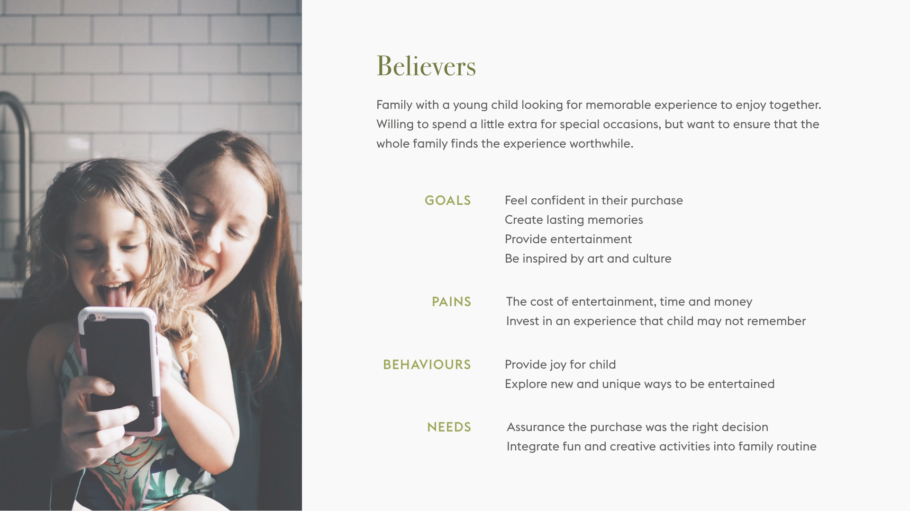

# Storybooks by Cirque du Soleil

A digital picture book created to entice a new generation of Cirque du Soleil fans.

- Type Academic team project
- Date Fall 2018
- Duration 4 weeks
- Contribution Content Strategy

### Sussing out the problem

With over 180 million people who have already seen a show, there is rising concern that Cirque du Soleil has failed to continuously innovate in a way that drives continued customer engagement, like they did in previous decades. In 2016, Cirque du Soleil’s revenue due to declined ticket sales of 36.6 percent in 2016.

After watching a show ourselves, we realized that even the best in-show experience we could design would only pale in comparison to the magic that is a Cirque du Soleil performance. So instead, we needed to establish our own guidelines to design a product that would engage existing and new viewers without compromising the Cirque’s existing product.

### Gathering key insights

To better understand the brand, we did a deep dive into the creative processes of a Cirque du Soleil production. Every show begins with seeking within their diverse team of performers who represent over 40 nationalities. Extraordinary artists specializing in African dancing, Peking opera, and many other are asked to speak about their artistic journeys. Their stories and talents are then extracted, elaborated and materialized into narrative driven productions shared with the world. This was it. This was Cirque’s secret ingredient to artful productions: the ability to bring dreams into reality.

We contrasted this finding with the customer’s perception. Through interviews and Yelp reviews, we identified a common pattern: customers often could not fully grasp the shows’ storylines. We dove into this concept of using storytelling to prolong memories, which led us to a few videos of parent-child reading behaviors. There, we found another a pattern: parents often resurfaced ideas from the stories to engage their child more deeply.

### Setting our goals

We wanted to design a product that:

1. Adds value for customers without distracting them from the show
2. Leverages Cirque’s existing library of imagery and storytelling to inspire customers
3. Allows customers to relieve the memories of the show

### Creating a persona

Identifying a well-rounded persona allowed us to strategically design for a specific audience: a parent and their young child.

### Detailing the customer’s experience

In order to achieve brand loyalty, customers would remain within this lifecycle, but there’s opportunity to drift off and leave the brand after seeing the show. To secure the cycle, our area of intervention adds value to the existing product and puts the brand forefront of their minds so they would be more likely to purchase future tickets or be open to engage with the brand again.

### Testing our assumptions

Of course, we still had some unanswered questions that we kept in mind during the design process:

1. How much impact can a separate digital product have on the actual ticket purchasing decision?
2. Would any want to spend time and effort to interact with the brand after the show?

To answer these questions we decided to intervene during the moments after the show. We honed in on 2 main touchpoints in the journey to address our concerns about bridging the show to our product. We took advantage of the peak that occurs after the show and early in the day after when the show is still fresh in their minds.

### The design

Storybooks is an interactive children’s book for Cirque du Soleil has the potential to highlight the beauty, creativity, and wonder Cirque offers it’s live show-goers, while introducing and underscoring the brand’s values of imagination, emotion and sense to a new generation of audiences. By extending the dream-like experience of Cirque beyond the show, we can strengthen audience enthusiasm and develop lingering memories that may develop an ongoing relationship with the brand and drive repeat viewership over time.

<iframe src="https://www.youtube.com/embed/267xJ-qFs18" width="600" height="400"></iframe>

## The retrospective

### Focusing on less but better

By zeroing in on specific area to intervene, we were able to define the parameters of our design early in the process. This specificity gave us the freedom to dive deep and flesh out the interactions inside and around Storybooks.

### Usability for young users

Though we gathered insights from parents with younger children and successful storytelling precedents (such as AKQA’s The Snow Fox, WWF Together, and The Fantastic Flying Books of Mr. Morris Lessmore), we did not perform comprehensive user tests to validate our design. Developing empathy for such a user who is only just learning to read is no simple task. To reexamine this work, I would like to begin with a ludic approach. By observing children interact with toys and interfaces, I might find patterns in what entices them and what bores them.
