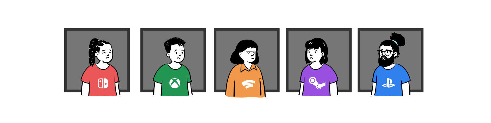
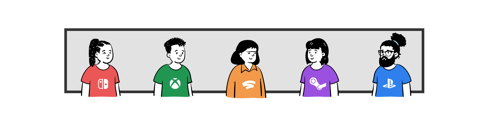

<ProjectHeading title='A Cross-Play Future by Electronic Arts' abstract='Enabling millions of players to play with anyone, anywhere' borderBottom />

<ProjectSection>
  <ProjectInfo title='Timeline' abstract='Ongoing' />
  <ProjectInfo title='Company' abstract='Electronic Arts' />
  <ProjectInfo title='Role' abstract='Product designer' />
</ProjectSection>

## Context

There’s always been a looming problem in gaming - players on one console can’t play with those on another.

Although players have accepted this reality to be the norm, my team and I have worked to break down these silos and bring players together in a way not previously possible enabling a new technology called cross-play.

To create these cross-play services, I co-designed and continue to own all social coordination features required for players to play safely and fairly across platforms.

## Impact

Currently, blockbuster games like [Apex Legends](https://www.ea.com/games/apex-legends/news/ea-play-announcements) and [Star Wars: Squadrons](https://www.ea.com/games/starwars/squadrons/tips-and-tricks/how-to-play-with-friends-in-star-wars-squadrons) have already adopted crossplay functionality, which is defined by the design system I helped create. As a result, players of both franchises can now play with any other player across consoles and devices.

---

Though this current project is under an NDA, I would be glad to discuss my experience and learnings at Electronic Arts over a Zoom call.

<ButtonLink to="mailto:kristy.leung11@gmail.com?subject=Schedule%20a%20chat">Schedule a chat 👋🏽</ButtonLink>
