<ProjectHeading title='Taskforce Wildlife by United for Wildlife' abstract='Supporting transportation companies with becoming more resilient to the exploitation caused by illegal wildlife traffickers ' borderBottom huge />

<ProjectSection>
  <ProjectInfo title='Timeline' abstract='Launched Fall 2018' />
  <ProjectInfo title='Company' abstract='Edenspiekermann' />
  <ProjectInfo title='Role' abstract='I designed and iterated on core experiences within the application while reporting directly to the technical director of the product.' />
  <ProjectInfo title='About' abstract='Taskforce Wildlife is a tool that enables companies in the transport sector to assess their logistical decisions and confidently plan safe routes.' />
</ProjectSection>

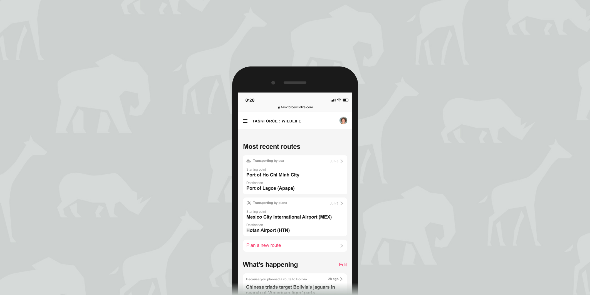

## Context

Organized criminal networks across the globe have caused an unprecedented increase in the illegal hunting and trading of animals. Traffickers exploit unsuspecting transport businesses, such as passenger and cargo airlines and shipping companies, by using them to smuggle their contraband.

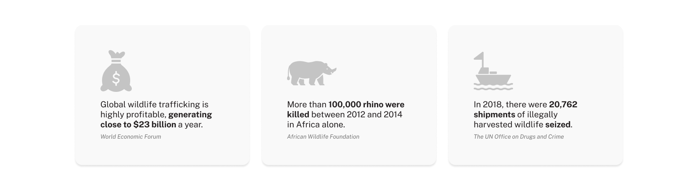

In response to the increase of illegal wildlife activities, [United for Wildlife](https://royalfoundation.com/programme/private-sector/) (UfW) approached my team at Edenspiekermann and asked us to explore approaches to slow the rate of wildlife trafficking.

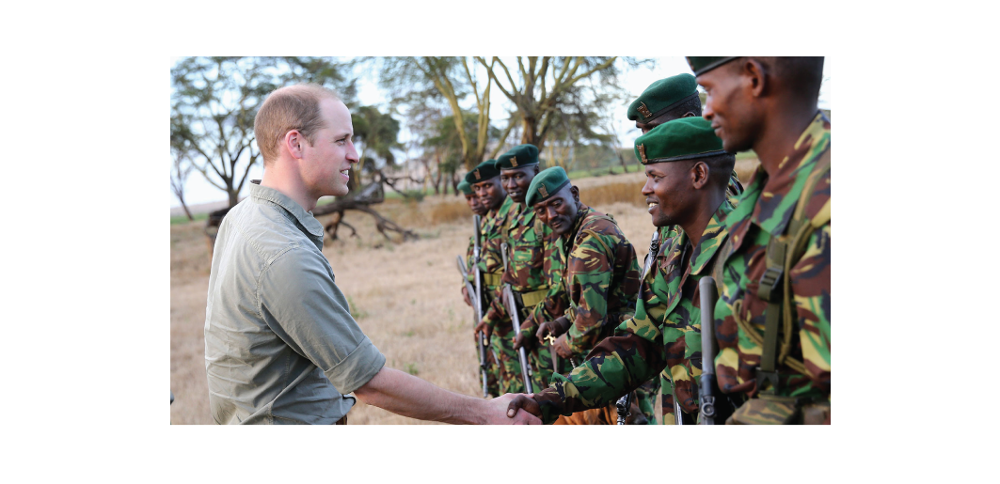

## Understanding wildlife trafficking

Due to the complexity of the problem, we looked for ways to pare it down to bite-sized pieces to tighten the scope. We conducted user interviews with the actors involved.

In the interview with the logistics team from Bangkok Airways, we learned transport businesses often unwittingly become conduits to illegal wildlife trading. To combat this, the logistics team aimed to help transport vehicles avoid compromised areas. Before a logistician plans a transport route, they attempt to track and analyse historic trafficking reports on the map.

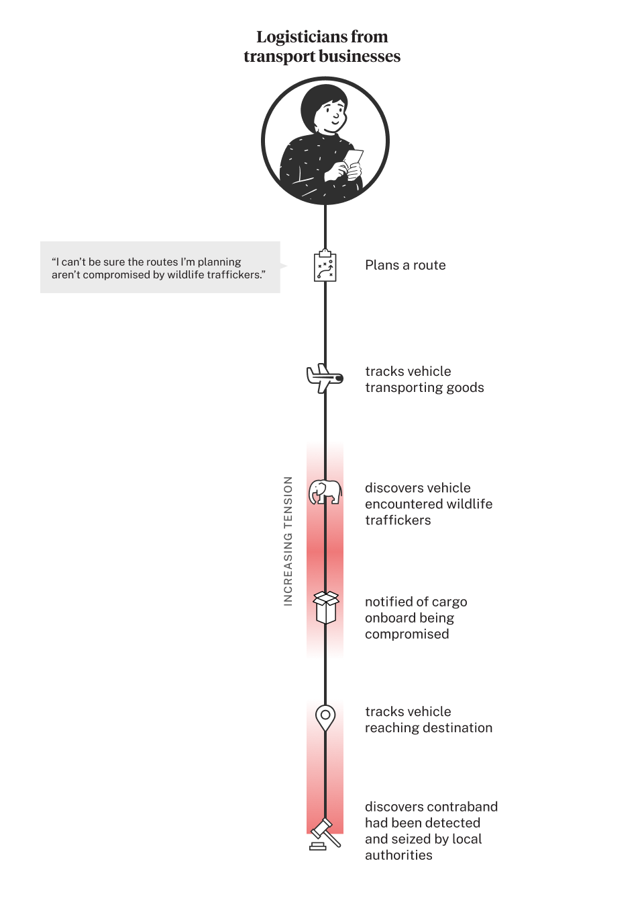

To understand the workflow of UfW wildlife rangers, we learned that they would make reports when they detect any suspicious activity. But these reports would often get buried in a dense backlog, rarely reaching transport businesses in time if at all.

### Key insights from logisticians

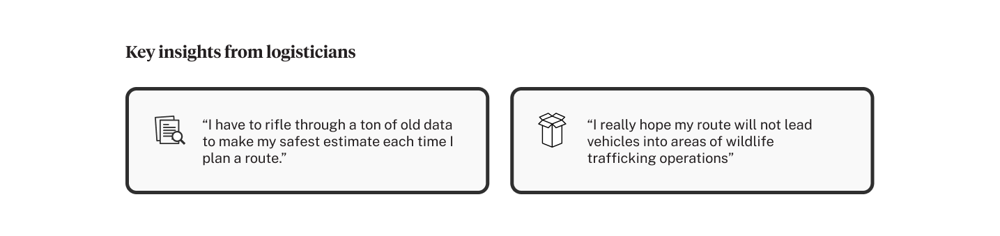

### Key insights from rangers

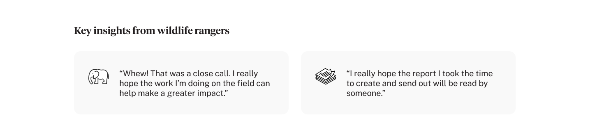

## Problem

- **Long-term goal**: To slow the rate of wildlife trafficking
- **Short-term goal**: To help transport businesses **outmaneuver wildlife traffickers**
- **Opportunity**: How can we help businesses **leverage the intel of rangers to avoid traffickers** en route?

## Explorations

I searched for precedents in the navigation domain for ideas that would rectify the anxiety of logisticians. My favorite was [TomTom’s Traffic](https://www.tomtom.com/products/real-time-traffic/), a tool that visualizes patterns of traffic congestion for drivers by analyzing historical traffic patterns for roads over time.

I wondered if we could bring the analysis of real-time reports to predict trafficking before it happens. In this early exploration, I ideated a tool that used existing risk reports to predict the safest and fastest routes. However, this idea required our tech team to amalgamate the technology behind each logistic solution used by logisticians. This wasn’t feasible for the scope of the project so I tabled the idea.

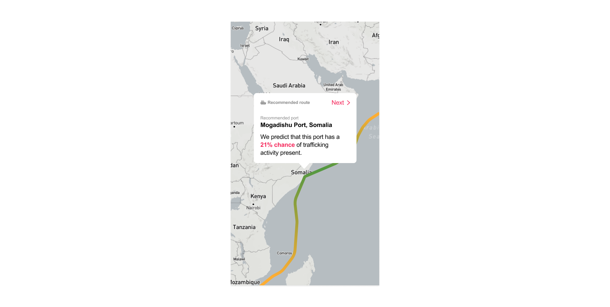

## Solution

I looked for ideas that would align with our tech constraints. I was specifically interested in the way analytic and forecasting tools made data actionable for users. I wondered if there was a way to achieve this by aggregating reports that are specific to a logistician’s route. Once again referencing notes from our Bangkok Airways interview, my tech director and I established a set of basic parameters needed from a route plan to assess the projected risk. I created an experience that allowed logisticians to input a route to see if it is safe.

### How Taskforce Wildlife works:

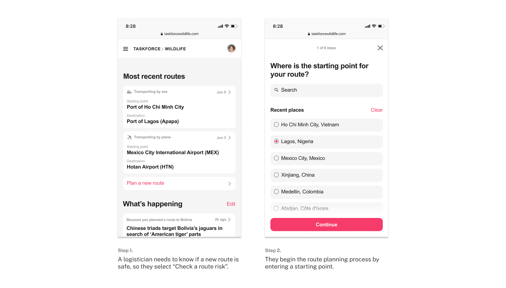

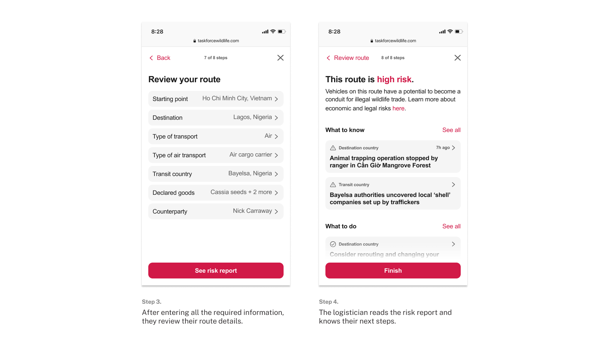

## Design Guidelines

Unlike many products on the market today, we knew a wildlife product needed to work with specific real-world constraints. For this reason, we established two major guidelines.

### Guideline #1: Prompt action without fear-mongering

The tool needed to present critical information and a ton of it. However, we knew that jampacking the tool with terrifying warnings and complicated jargon would only overwhelm transport businesses. The design needed to strike a balance between approachable and actionable without downplaying the severity or urgency of the issue.

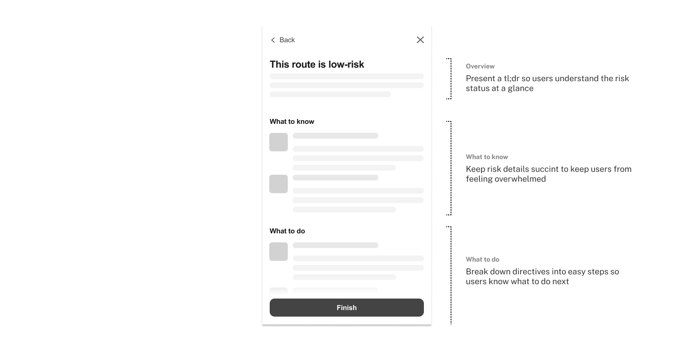

### Guideline #2: Provide accessibility

Users needed to be able to access Taskforce Wildlife while patrolling rural areas with limited technological access and send reports in real time. It needed to be lightweight, yet reliable. The design system needed to lean enough that loading time would not be compromised.

I worked closely with the technical director to develop a library of responsive components fluid across all screen sizes and browser versions. We also opted for typography and high contrast visual treatments that would be communicative in smaller and older devices.

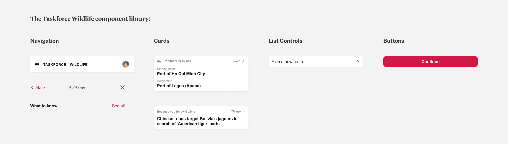

### Impact

Taskforce Wildlife has since garnered corporate buy-in from numerous businesses in the transport sector, including Virgin Atlantic. In late 2018, service was released and is used by thousands of rangers and logisticians across the globe. Our client, United for Wildlife reported back with very positive feedback from users. Additionally, this project was featured in a presentation led by the Duke of Cambridge at the 2018 Illegal Wildlife Trade Conference.
