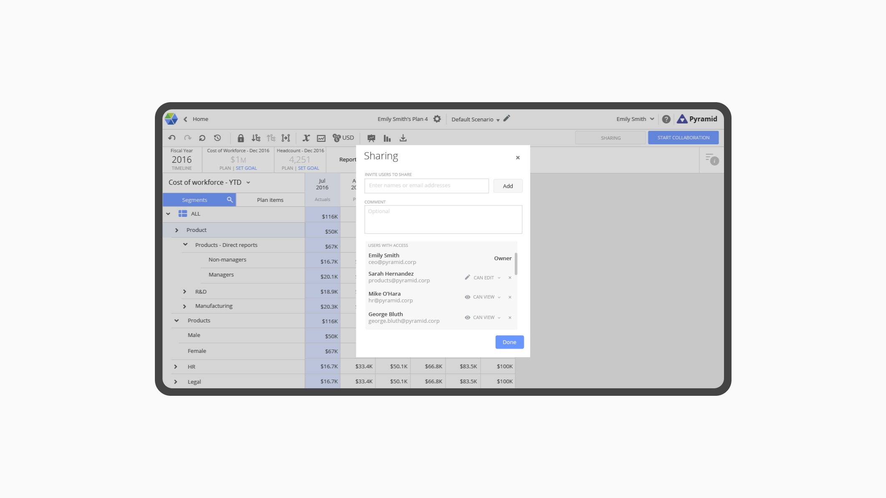
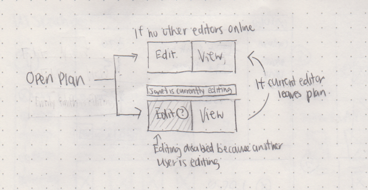
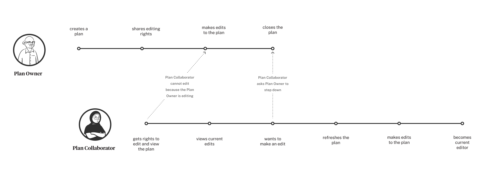
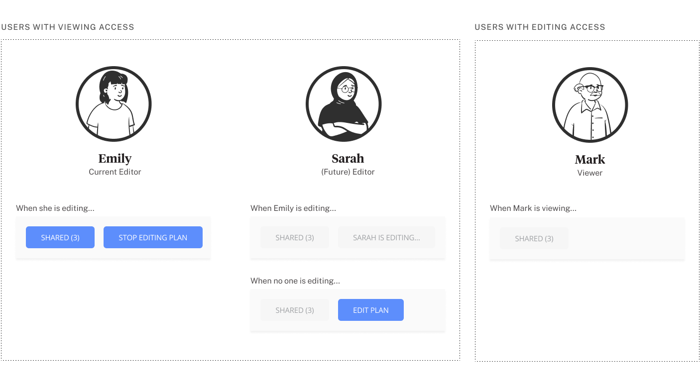

<ProjectHeading title='Workforce Planning by Visier' abstract=' Facilitating collaboration for businesses to analyse their headcount data' borderBottom />

<ProjectSection>
  <ProjectInfo title='Timeline' abstract='Launched Fall 2016' />
  <ProjectInfo title='Role' abstract='UX designer' />
</ProjectSection>

## Gathering domain knowledge

Workforce Planning (WFP) is a powerful application that allows users to project and analyze labor supply and demand based on economic factors by creating plans. During my 12-month work term as a UX Design Intern at Visier, I spent the majority of my time dedicated to designing features with the PM and Design Lead of WFP.

### Understanding the problem
In many use cases, there are multiple users within an organization who need to collaborate across teams to make decisions about a workforce. WFP needed a feature that allowed users to manage both sharing and editing rights in a plan. Upon speaking to the development team, I learned that WFP could not allow multiple users to edit simultaneously edits to a plan because a single edit generate changes to values across the grid. Unsurprisingly, this constraint added a new layer of complexity to my mental model of the application’s behavior.

### Pencils over pixels

This sketch details one of many early attempts to visually represent the behavior of the plan-sharing feature: a switch that could be toggled by an editor to turn editing capabilities on and off to allow another user to edit. However, certain back-end complications surfaced which required the user to manually refresh the plan in order for the sharing status to change. The toggle did not provide adequate visual cues to support this behavior.

### Taking a step back

At this point in the design process, I was bogged down by concerns like: How are rights of the shared users are specified? How multiple users with editing rights determine the sole current editor? How would an editor know to relinquish their role for another user? In moments like this, I returned to the prompt: “What might this look like if it were easy?” (borrowed from Tim Ferriss) which I often pondered during my work term at Visier. Since I was consistently facing new data or metric related concepts that I did not understand, I used this question to unshackle myself from the complexities and regain my bearings. So if designing the sharing feature were easy, a plan would, at the very least, would need the following things:

1. The ability to give another user editing or reading access to a plan
2. A simple method for an editor to start and end editing
3. A clear indicator of who the current and only editor is

After identifying these components, I was able to find a jumping off point and create a mind map and another iteration of the interface sketch.

### The design

A later reiteration encapsulated all three requirements determined before. The toggle from before was replaced by buttons that also double as status indicators.

<iframe width="560" height="315" src="https://www.youtube.com/embed/UuPQBFCXbd0" width="600" height="400"></iframe>

_This design was developed in the mockups below, and was implemented into the platform_

### The retrospective

Through the process of completing UX concepts and specifications for new features, I have learned the importance of finding the most feasible UX that supports the necessary functionality. To achieve this, I learned to be meticulous by questioning each moment in user interaction. Can I simply this method by using fewer affordances? How can I make this new functionality more accessible? Can I reuse an existing piece of UI or do I have to make a new one? If I propose a new interface, is it worthwhile for the developers to program? Can it reused? During the start of the work term, I often failed to ask these questions. As a result, I had to make many more iterations of the mockups to achieve the completeness I would have had if I considered the previous questions.

## Other Projects

### Data Management Tool

I worked with a Data Engineer intern to design and help implement (using HTML and LESS) an overhaul for an internal tool that helped reconfigure, validate and load incoming data into the Visier database. My contribution laid down the groundwork for the tool to continuously grow and assist Data Engineers in other aspects of their work.

### WFP Reintegration

Visier is currently in the process of integrating WFP into a new platform with other tools. By doing so, WFP will be more effective in sharing their plans, forecasts and budgets to the platform's business users. During the later months of my work term, I worked alongside the WFP PM and UX Lead to develop a comprehensive set of mockups which detailed end to end user work flows of the application.
